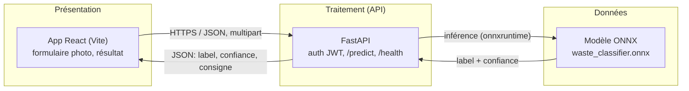
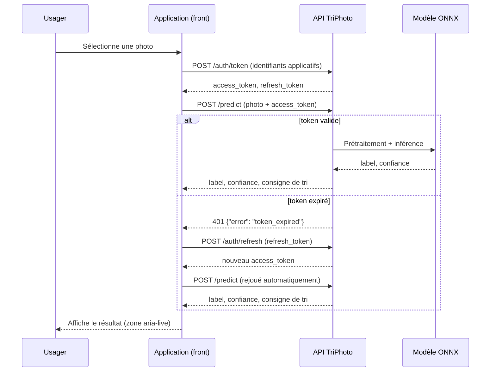

# Architecture technique — TriPhoto

## Vue d'ensemble (n-tiers)

Trois couches séparées, chacune déployable et testable indépendamment — c'est ce découplage qui permet d'avoir deux pipelines CI/CD distincts (`ci-model.yml` pour le modèle, `ci-app.yml` pour l'application).

## Choix techniques

| Composant | Choix | Justification |
|---|---|---|
| API | FastAPI (Python) | Typage natif via Pydantic, doc OpenAPI générée automatiquement (exigence C9), écosystème ML (onnxruntime) cohérent avec le langage d'entraînement. |
| Modèle | PyTorch (entraînement) → ONNX (inférence) | ONNX découple l'entraînement (PyTorch/torchvision) du runtime d'inférence servi par l'API — l'API n'a pas besoin d'installer PyTorch, juste `onnxruntime`, beaucoup plus léger à déployer. |
| Front | React + Vite (TypeScript) | Build rapide, HMR en dev, étape de packaging claire (`vite build`) pour C19, typage strict pour limiter les bugs d'intégration avec l'API. |
| Auth | JWT (access + refresh) | Standard, sans état côté serveur, renouvellement explicite du token (C10) sans re-demander les identifiants à chaque appel. |
| Conteneurisation | Docker (image API, image front + nginx) | Portabilité entre environnement de dev, CI et pré-production ; cohérent avec le "packaging" attendu par C13/C19. |

## Environnement d'exécution et dépendances

- API : Python 3.12, FastAPI, onnxruntime (CPU), voir `api/requirements.txt`.
- ML : Python 3.12, PyTorch/torchvision (CPU) pour l'entraînement uniquement — jamais embarqué dans l'image de production de l'API, voir `ml/requirements.txt`.
- App : Node 20, Vite 6, React 18, voir `app/package.json`.

## Choix éco-responsables

- **Backbone gelé (frozen) à l'entraînement** : seule la tête de classification est ré-entraînée (quelques milliers de paramètres contre ~1M pour le backbone complet) — un entraînement complet prend quelques minutes sur CPU au lieu de nécessiter un GPU dédié.
- **ONNX + CPU en production** : pas de dépendance GPU pour servir les prédictions, l'inférence sur une image (224×224) prend quelques dizaines de millisecondes sur CPU standard.
- **Docker slim** : images de base `python:3.12-slim` et `node:20-slim` / `nginx:alpine` plutôt que les images complètes, pour réduire la taille transférée et stockée.
- Hébergement visé pour la pré-production : offre PaaS avec facturation à l'usage (ex. Render, Fly.io) plutôt qu'un serveur dédié qui tournerait en continu pour un trafic de démonstration faible.

## Flux de données

**Donnée personnelle en jeu** : la photo elle-même peut, dans de rares cas, contenir incidemment des éléments identifiants (reflet, arrière-plan d'un domicile). Elle n'est jamais stockée ni journalisée par l'API — traitée en mémoire pour l'inférence puis immédiatement écartée. Voir `docs/rgpd.md`.

## Preuve de concept (pré-production)

Statut : **déployée et fonctionnelle** (12/08/2026), sur Render (offre gratuite), via le blueprint `render.yaml` à la racine du repo.

- API : https://triphoto-api.onrender.com (`/health` confirme `model_mode: "onnx"` — le vrai modèle entraîné, pas le stub)
- Application : https://triphoto-app.onrender.com

**Test d'accès effectué** : upload d'une vraie photo (bouteille plastique) sur l'app en production → appel réel de l'API → réponse correcte ("Plastique / Bac jaune (tri sélectif)", confiance 100 %) → zéro erreur console. CORS entre les deux services (`ALLOWED_ORIGINS` / `VITE_API_BASE_URL`) fonctionnel sans ajustement manuel, les deux URLs assignées par Render correspondant à celles anticipées dans `render.yaml`.

**Limite connue de l'offre gratuite** : le service API s'endort après 15 minutes d'inactivité et met 20-50 secondes à répondre à la requête suivante (le reste du temps, < 400 ms). À anticiper avant la démonstration en soutenance en rechargeant l'app quelques minutes avant de passer.
