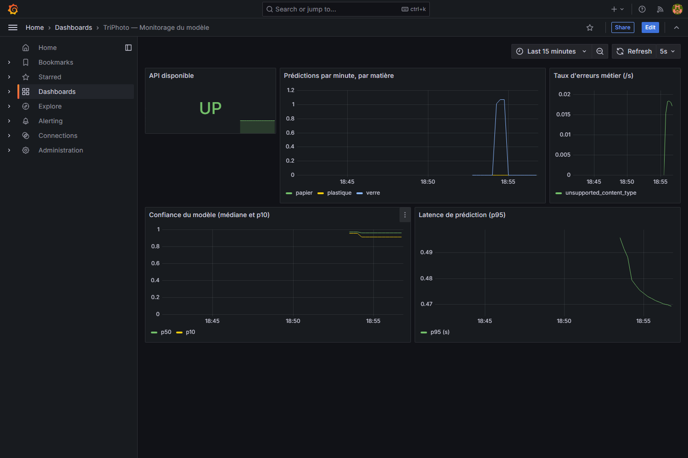

# Monitorage du modèle — TriPhoto (C11)

## Outils retenus

| Outil | Rôle |
|---|---|
| `prometheus-client` + `prometheus-fastapi-instrumentator` | Collecteurs, intégrés directement dans l'API (`api/core/metrics.py`, exposés sur `GET /metrics`). |
| Prometheus | Scrape `/metrics` toutes les 15s, évalue les règles d'alerte (`monitoring/alerts.yml`). |
| Alertmanager | Reçoit les alertes de Prometheus, les route vers un récepteur (webhook en bac à sable, e-mail en production). |
| Grafana | Restitution temps réel — dashboard provisionné automatiquement (`monitoring/grafana/`). |

Choisis parce que c'est la combinaison standard de facto pour ce genre de service (large écosystème, alerting déclaratif en PromQL, dashboards Grafana réutilisables), et parce que `prometheus-fastapi-instrumentator` s'intègre en trois lignes dans FastAPI sans réinventer la collecte des métriques HTTP génériques.

## Métriques suivies et justification

| Métrique | Type | Ce qu'elle révèle |
|---|---|---|
| `triphoto_predictions_total{label, model_mode}` | Counter | Volumétrie par matière prédite. Une classe qui domine anormalement = signal de dérive des données en entrée. |
| `triphoto_prediction_confidence` | Histogram | Distribution de la confiance du modèle. Médiane qui chute = proxy de dérive du modèle/des données, sans avoir besoin des vraies étiquettes (jamais disponibles en production ici). |
| `triphoto_prediction_errors_total{reason}` | Counter | Erreurs métier (format refusé, fichier vide/trop lourd) — distinct des erreurs HTTP génériques. |
| `triphoto_prediction_latency_seconds` | Histogram | Performance du modèle/service — dégradation de la latence de traitement. |
| Métriques HTTP génériques (via l'instrumentator) | Counter/Histogram | Bonne santé du système : requêtes par code retour, latence par endpoint. |

## Règles d'alerte (`monitoring/alerts.yml`)

| Alerte | Condition | Sévérité |
|---|---|---|
| `APIDown` | Cible non joignable par Prometheus depuis 1 min | critical |
| `HighPredictionErrorRate` | > 0,2 erreur/s en moyenne sur 5 min | warning |
| `LowAverageModelConfidence` | Confiance médiane < 0,5 sur 15 min | warning |
| `HighPredictionLatency` | p95 de latence > 1s sur 5 min | warning |

## Lancer la chaîne complète

```bash
docker compose -f monitoring/docker-compose.monitoring.yml up --build
```
- Prometheus : http://localhost:9090
- Alertmanager : http://localhost:9093
- Grafana : http://localhost:3000 (admin / admin) — dashboard "TriPhoto — Monitorage du modèle" provisionné automatiquement.

## Validation effectuée (bac à sable, avant intégration)

Conformément à l'exigence "la chaîne de monitorage est d'abord testée dans un bac à sable" :

1. **Validation statique des configurations**, avec les outils officiels (pas juste un parseur YAML générique) :
   - `promtool check config prometheus.yml` → `SUCCESS`
   - `promtool check rules alerts.yml` → `SUCCESS: 4 rules found`
   - `amtool check-config alertmanager.yml` → `SUCCESS`

2. **Test de bout en bout en conditions réelles**, sans Docker (Prometheus/Alertmanager lancés en binaires locaux, API en local, seuils temporairement raccourcis pour observer le cycle complet en quelques secondes plutôt qu'en minutes) :
   - API démarrée, `/health` confirme `model_mode: onnx`.
   - Prometheus confirme la cible `triphoto-api` en état `up`.
   - 41 requêtes invalides envoyées à `/predict` (content-type refusé) → `triphoto_prediction_errors_total{reason="unsupported_content_type"}` incrémenté à 41 côté `/metrics`.
   - La règle `HighPredictionErrorRate` passe en état **`firing`** dans Prometheus.
   - Alertmanager reçoit l'alerte et **POST** effectivement le webhook configuré — confirmé par le récepteur de test :
     ```
     firing   HighPredictionErrorRate warning
     resolved HighPredictionErrorRate warning
     ```
     Le passage à `resolved` une fois le flux d'erreurs arrêté confirme que le cycle complet (déclenchement **et** résolution) fonctionne, pas seulement le déclenchement.

Ce test prouve que la chaîne fonctionne réellement de la métrique jusqu'à la notification — pas seulement que les fichiers de config sont syntaxiquement valides.

3. **Dashboard Grafana vérifié avec de vraies données de production** (18/08/2026) : Prometheus et Grafana lancés en conteneurs Docker (réseau dédié, provisioning du dépôt monté directement), Prometheus configuré pour scruter `/metrics` de **l'API en production** (`triphoto-api.onrender.com`) plutôt qu'un environnement de test. Trafic réel généré (prédictions et erreurs volontaires) pour peupler les panneaux :

   

   Les cinq panneaux affichent des données réellement mesurées, pas des exemples fictifs : disponibilité de l'API, volumétrie des prédictions par matière, taux d'erreurs métier, confiance du modèle (p50/p10) et latence p95 — tous réagissent visiblement au trafic généré pendant le test.

## Ce qui reste à faire avant un déploiement réel

- Remplacer le récepteur webhook de test par un vrai canal (e-mail SMTP, Slack) — modèle de config e-mail déjà présent en commentaire dans `monitoring/alertmanager.yml`.
- Vérifier qu'aucun outil d'infrastructure tiers (reverse proxy, etc.) ne journalise le corps des requêtes `POST /predict` (qui contient la photo) — voir `docs/rgpd.md`.
- Ajuster les seuils (`0.2` erreur/s, confiance `< 0.5`, latence `> 1s`) une fois un vrai trafic de production observé — les valeurs actuelles sont des points de départ raisonnables, pas des seuils calibrés sur des données réelles.
